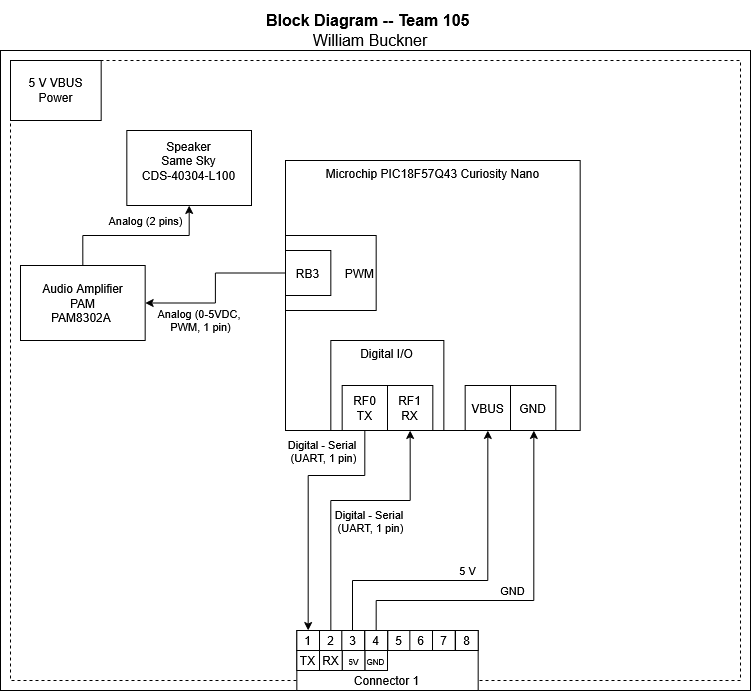

## Overview
This is a block diagram of my planned circuit for group 105. The main component that I have chosen for the project is a speaker, with an amplifier to help drive the speaker. As a team we decided to have power all be supplied by the primary boards VBUS, and then transfer that power over through the 8-pin connector on the boards. Similarly we are using UART as our main method of communication between boards, hence the RX and TX connections. We also determined that we are doing a wheel and spoke setup, meaning we have a singular main board, with all of the communication going through that board before heading off to other sections. 

